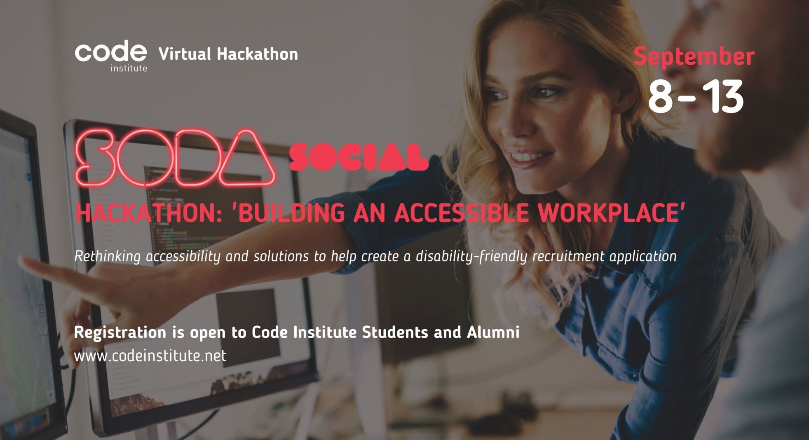
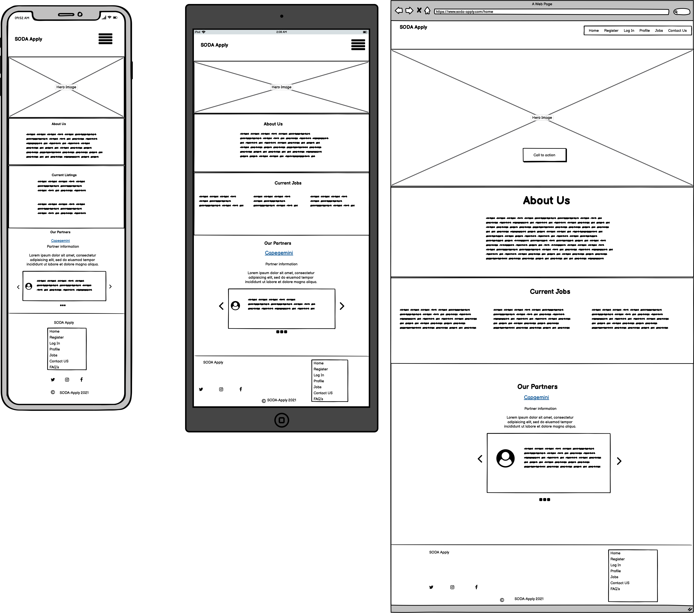
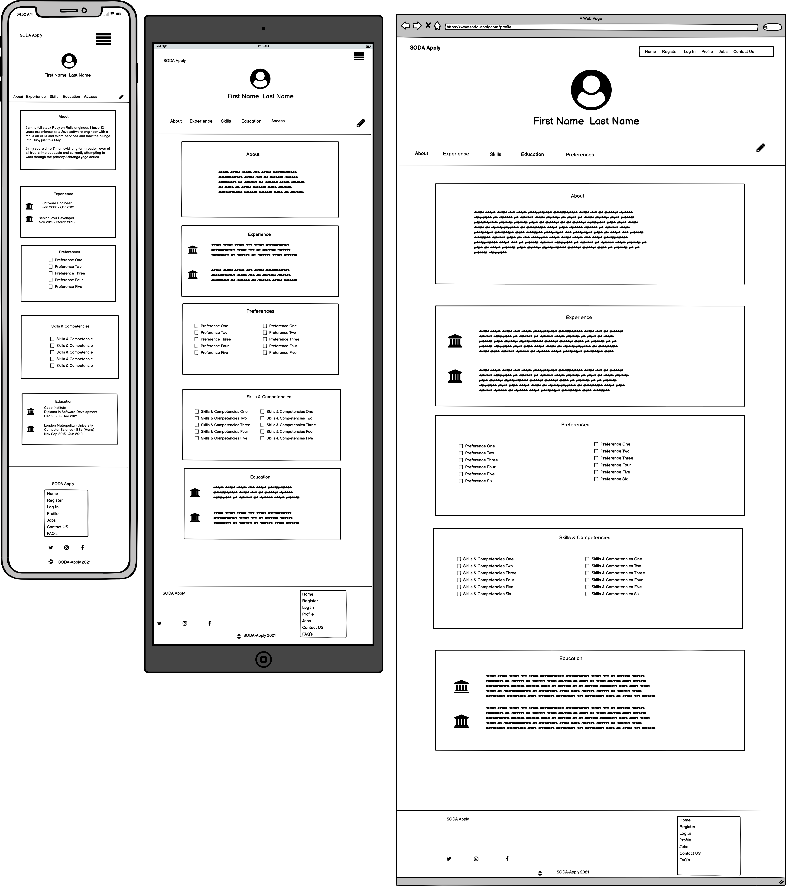

   
  

SODA Apply  
Don't just apply, SODA Apply!

# Soda-Apply
------
## Table of Contents
------

* Strategy
* User Stories
* Client Goals
* Scope
* Features & Functional Requirements
* Security
* Data Management
* Content and Structure requirements
* Structure
* Conceptual Design
* Database Schema
* Skeleton
* Wireframes
* Design Inspiration and color choices
* Typography
* Imagery
* Core Features
* Future Implementations
* Bugs & Fixes
* Implementation
* Deployment
* To deploy to Heroku
* Forking the GitHub Repository
* Making a Local Clone
* Testing
* Technologies Used
* Languages Used
* Frameworks, Libraries, Programs & Platforms Used
* Credits
* Acknowledgements

## Strategy
------

As part of the Trust in Soda Hackathon with the Code Institute, the following brief was given;

* Create a tool that helps employers create a truly accessible workspace, or improve their recruitment and onboarding   experience for every person.*
	
>Soda-Apply aims to solve the following issues in the
>recruitment of people with disabilities.  
	
* Issue 1)  	Excluding potential applicants based on advertising methods.
* Issue 2)   	Measurement of an applicant's potential based on the interview environment. 

**The main goal of the Soda-Apply app is to:**

* Simplify the user process of job application
* Simplify explanation of specific requirements / assistive technologies needed for interview process / work environment.
* Creating a profile once in the accessibly designed platform.
* Ability to share the profile directly 

	**Real World usage:**  

>We envisage that Soda-Apply would become a plugin for HR companies and larger corporations with the user able 
>to ‘Soda-Apply’ through a button on the HR / Corp website to submit details in a single click.  

## Primary USER -  Job seeker with disability/ies
------
**As a first time user I would like to:**
* Have a clear indication of the purpose of the site
* Be able to register with a well labelled regular spaced form
* Be able to ‘show password’
* Be presented with clear concise bullet points / not long-winded sentences
* Be able to move throughout the site without animation / video / sound unless chosen 
* Be able to use the site easily with

**Nice to have:**

* Ability to change the colour scheme to suit needs
* Ability to enlarge the text and buttons with a single click.

**As a repeat user I would like to:**
* Easily access and edit my profile 
* See what jobs I have applied to 
* Not be shown jobs that I have already applied to
* Contact Soda-Apply if I need further assistance
* Contact Soda-Apply if I have a recommendation for improvement of the process. 

## Client User Goals - HR company 
------
* To be able to normalise / simplify the recruitment process for people with disabilities 
* To be able to consider accessibility requirements in advance to reach a match for the person / role seamlessly. 
* To promote the company as an accessible recruiter so as not to miss out on the 20% of people worldwide who have accessibility requirements. 

## As a recruiter I would like to be able to:
* Put potential candidates at ease
* View the candidates skills or CV 
* Understand accessibility requirements for application process
* Understand accessibility requirements for interview process
* Understand accessibility requirements for thriving in a potential role. 

## Scope
------

### Features & Functional Requirements
------

* About page to explain the reason for the site
* Registration page to create a profile
* Ability to upload a CV to the profile - preferably in multiple formats
* Profile page that can be edited / updated / deleted
* Jobs listings 
* Admin access page to edit content / listing / profiles if further assistance is needed 
* Partners page to list recruitment partners 
* Contact us ability 

### Accessibility Specific & a11y features
------

* Accessify testing
* Accesslint:
How it works
AccessLint brings automated web accessibility testing into your development workflow. When a pull request is opened, AccessLint reviews the changes and comments with any new accessibility issues, giving you quick, timely, and targeted feedback, before code goes live.
* Lighthouse accessibility will also be an key factor in assessing the app.

#### Security
------
The profile pages should only have edit and delete functionalities for:
* Admin / superuser
* Profile creator
* Werkzeug will be used for password hashing
* Sessions will be used 

Others should not be able to access the profile (for example by url). 

#### Data Management
------

Postgres will be used as the relational database for storing the data of the user profiles. 
It will be necessary to:

* **ensure there is no one step deletion** of data and that **delete buttons are labelled** (not just icons)

* Access functionality managed through app routes and jinja templating to make use of session user cookies, but also data matching

#### UX
------

The app should employ features for accessibility inline with the User Story requirements. 

## Structure
------

#### Conceptual Design
------
(add a user flow-chart here including CRUD operations)

#### Database Schema 
------
(add database schema here)

#### Skeleton
------

#### Wireframes
------
* Wireframes were created using the [Balsamiq](https://balsamiq.com/wireframes/) software.

**Home Page**

* The Home page features a Hero Image with a call to action, prompting users to create an account with SODA Apply.
* The About US sections allows users to get to know us and immediately know that accessability is our number one priority.
* Using Roboto font, a monochromatic color palette and lots of white space provide demonstrate an accessible appearance.

**Profile Page**

* The profile page is designed to be a scrollable page with easy access to the various sections.
* Links to all sections are at the top of the profile page with back-to-top links.

All wireframes.
* [Home](docs/wireframes/Home.png)
* [Profile](docs/wireframes/Profile.png)
* [Jobs](docs/wireframes/Jobs.png)
* [Job-Details](docs/Job-Details/Profile.png)
* [Register](docs/wireframes/Register.png)
* [Log In](docs/wireframes/login.png)
* [Contact Us](docs/wireframes/Contact-us.png)
* [FAQ](docs/wireframes/FAQ.png)

A pdf of the wireframes can be found [here](doc/wireframes/soda-apply_wireframes.pdf), by clicking on the download button in Github. (**Please Note:** _[Adobe Acrobat Reader](https://get.adobe.com/reader/) is required to view files in pdf format_).

#### [Back to top](<#table-of-content>)

#### Design Inspiration & Colour choices
------
Theme for design and colour choices was taken from looking at other sites that score well on the accessibility in google lighthouse, as well as wanting the look to be inline with the Client themes - In this case Trust in Soda.  
#### Typography
------
Fonts must be accessible leading to a choice of Roboto & Arvo accessible text imports. 

#### Imagery
------
**(imagery chose goes here)**

#### Core Features
------
* Simply designed home page
* Registration form designed for utmost accessibility with profile questions relating to easing the recruitment process f for the candidate. 
* Upload CV to profile page
* Share profile with potential employers (in read only format)
* Ability to edit or delete profile as user of said profile or as an admin
(potentially) API link to jobs 
* Simply designed FAQ’s
* Contact us functionality

#### Future Implementations
------

* Create as a plug-in for HR or Corporate recruiters. 

#### Bugs & Fixes
------
**Bugs and fixes to go here**

#### Implementation
------

#### Deployment
------
* To deploy to Heroku
* Forking the GitHub Repository
* Making a Local Clone

#### Testing
------

#### Technologies Used
------
* Languages Used:
	* HTML5
	* CSS3
	* Javascript
	* Python
* Frameworks, Libraries, Programs & Platforms Used:
		* Flask
		* Postgres
		* Bootstrap5
		* Jinja

#### Credits
------

#### Acknowledgements
------